# Latest Projects

## 1. KostBuddy
**Client:**  
PT Sentra Teknologi Nusantara  
**Description:**  
An Android app for booking a boarding house.  
**Technologies used:**  
Kotlin, Ruby on Rails  
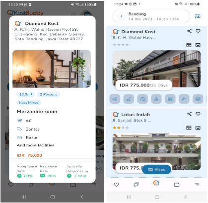

## 2. Docyt
**Client:**  
Docyt Inc.  
**Description:**  
Docyt is a real-time accounting automation platform. It uses AI and machine learning to automate financial workflows, 
continuously reconcile the general ledger, and generate real-time financial reports.  
**Technologies used:**  
React, Ruby on Rails  
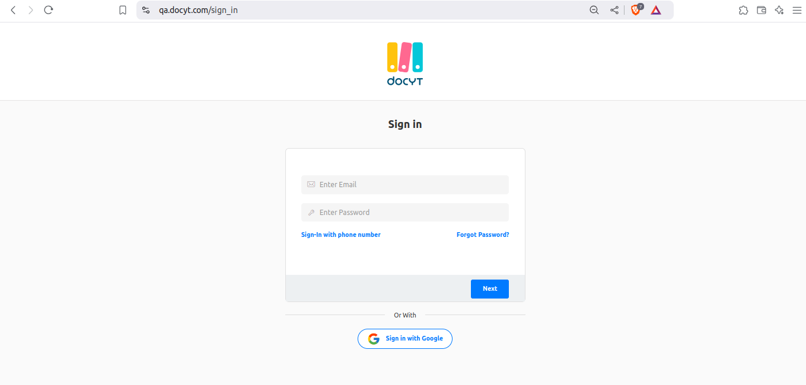

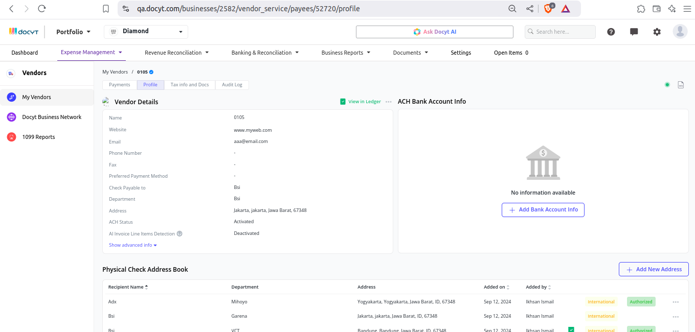

## 3. Jalan Nusa
**Client:**  
PT Teknologi Madani Utama  
**Description:**  
An app that helps businesses manage billing information and transactions.  
**Technologies used:**  
React Native, Ruby on Rails  
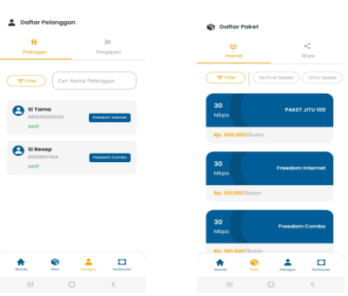

## 4. Legal Application System (LApS)
**Client:**  
PT Bank Tabungan Negara  
**Description:**  
An app for registering and monitoring legal cases.  
**Technologies used:**  
React Native, Ruby on Rails  
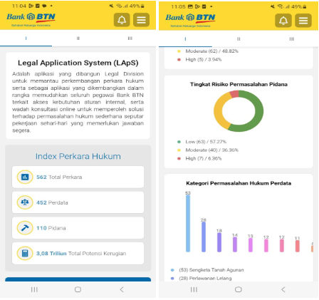

## 5. MR. RE (Royal Enfield Indonesian Community)
**Client:**  
Indonesian Royal Enfield Community  
**Description:**  
An application used for scanning at competition events.  
**Technologies used:**  
Kotlin, Ruby on Rails  
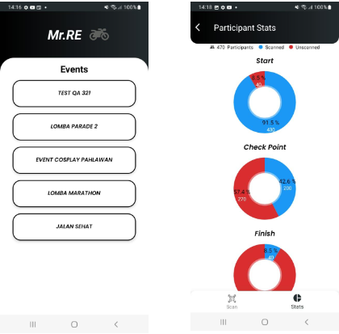

## 6. KMS Waskita Mobile Apps
**Client:**  
PT Waskita Karya  
**Description:**  
A system application for managing company documents and knowledge management.  
**Technologies used:**  
Flutter, PHP, Laravel  
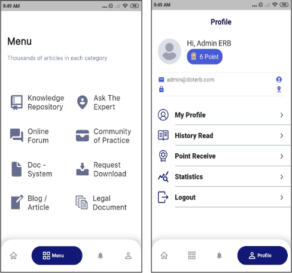

**App Store:**
https://apps.apple.com/id/app/weshare/id1582227278

## 7. Integrasi Ekosistem UMKM - Kab. Bandung
**Client:**  
Wakil Bupati Bandung - Sahrul Gunawan  
**Description:**  
An UMKM application for the Bandung district.  
**Technologies used:**  
React Native, Ruby on Rails  
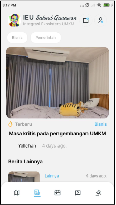

## 8. Rocca Space
**Client:**  
Rocca Space  
**Description:**  
An application used by Rocca Space staff to scan participant attendance.  
**Technologies used:**  
Kotlin, Ruby on Rails  
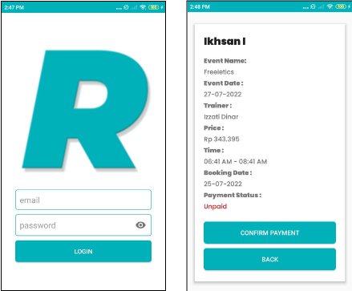

## 9. Travelsquare
**Client:**  
PT Travel Square Global  
**Description:**  
An Android app for booking hotels and holiday bundles.  
**Technologies used:**  
Kotlin, Ruby on Rails  
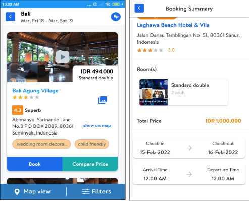

## 10. BISA (Brilliant Innovative, Speed, Accountable)
**Client:**  
Polda Banten  
**Description:**  
An information app that includes the Polda Banten profile, weather information, and news.  
**Technologies used:**  
Kotlin, Python, Django  
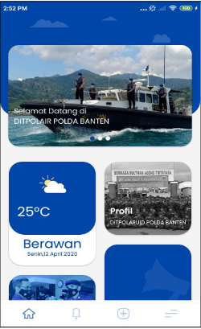
